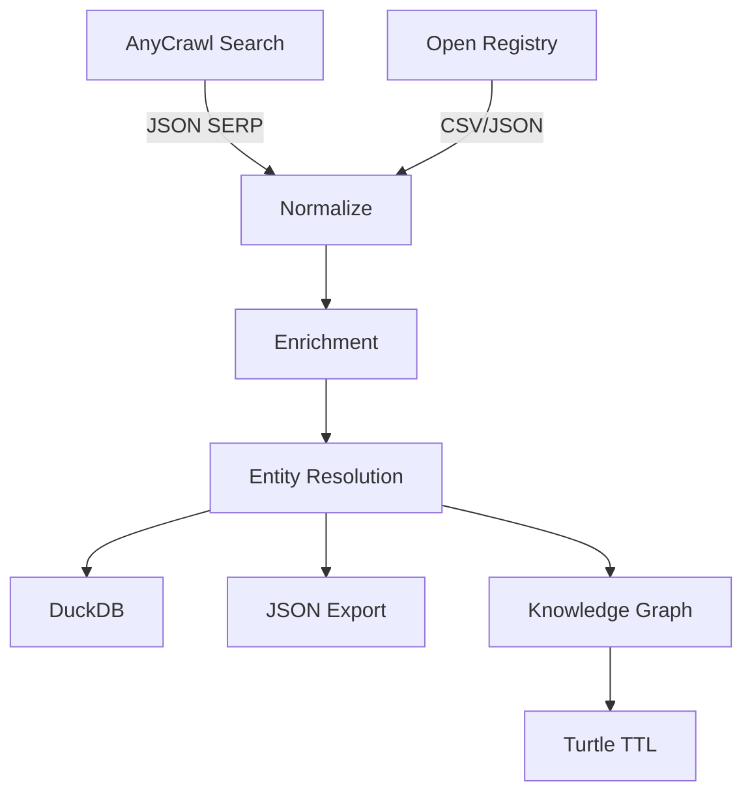

# Oriundi Radar – Architettura Tecnica

## Stack principale

| Layer | Tecnologia | Note |
|-------|------------|------|
| Orchestrazione | Python 3.12 + Typer CLI | Invocazione pipeline locale o CI |
| Configurazione | dataclass + parser TOML | Config da env/TOML con override da env |
| Data ingest | stdlib `urllib` (fallback) + `requests` (extra) | AnyCrawl API + open data registry |
| Storage | JSON base, DuckDB (extra) | Persistenza locale con export JSON/TTL |
| Data Processing | stdlib (`difflib`) + optional `pandas`/`rapidfuzz` | Normalizzazione + entity resolution |
| Enrichment | stdlib + opzionale `tqdm`/`spaCy` | Social heuristics + NLP geopolitica |
| Knowledge Graph | writer TTL custom (base) + opzionale `networkx`/`rdflib` | Grafi multi-edge + export Turtle |
| Testing/Lint | `pytest`, `ruff` | Suite minima per regressioni |

## Flusso dati

## Sicurezza & Compliance

- **Rate limiting** configurabile per proteggere gli endpoint AnyCrawl/open data.
- **Audit trail** tramite export JSON versionabile (Git LFS o S3 consigliati).
- **Data minimization**: schema normalizzato limita i campi personali superflui.
- **Privacy by design**: il modulo NLP può essere disattivato se non ci sono basi giuridiche.
- **Integrazione legale**: log delle fonti `article.url` per supportare verifiche manuali.

## Deployment suggerito

1. Contenitore Docker con immagine Python slim + dipendenze dal `pyproject`.
2. CI/CD GitHub Actions con job programmati (cron) per aggiornare gli export.
3. Persistenza su bucket S3 (export) e database analitico DuckDB su volume montato.
4. Opzionale: sincronizzazione `knowledge_graph.ttl` verso Neo4j o GraphDB per query avanzate.

## Estensioni future

- Integrazione con API FIGC/UEFA per whitelist passaporti.
- Modulo `prefect` o `dagster` per orchestrazione multi-step.
- Arricchimento con segnali social (Instagram follower, LinkedIn) tramite API ufficiali.
- Dashboard `Streamlit` per consultazione interattiva degli oriundi candidati.
